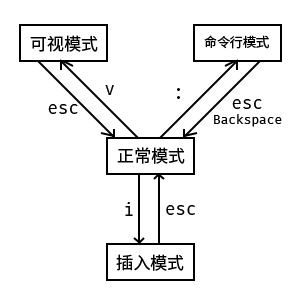

# Vim 小结
### 1. Vim 的各种模式
Vim 具有 4 种基本模式：普通模式、插入模式、可视模式、命令行模式。
#### 普通模式 ( Normal mode )
在普通模式中，用的编辑器命令，比如移动光标，删除文本等等。这也是 Vim 启动后的默认模式。__在普通模式下无法通过键盘输入文本！__
#### 插入模式 ( Insert mode )
一般文本编辑器的模式，__在插入模式下可以用键盘正常的输入文本。__
#### 可视模式 ( Visual mode )
在这个模式下光标会选中所经过的文本，__作用与按住左键移动光标差不多。__
#### 命令行模式 ( Commandline mode )
在命令行模式中可以输入会被解释成并执行的文本。例如执行命令（ `:` 键），搜索（ `/` 和 `?` 键）或者过滤命令（ `!` 键）。在命令执行之后， Vim 返回到命令行模式之前的模式，通常是普通模式。

### 2. Vim 的文件操作 ( 打开，保存，退出 )
一般的，Vim 的文件操作是使用命令行模式进行。

| 名称       | 命令        | 全称             |
| ------------ | ------------- | ------------------ |
| 新建       | `:new`        | New               |
| 打开       | `:e filename` | Open               |
| 保存       | `:w`          | Write              |
| 另存为      | `:w filename` | Write As           |
| 退出       | `:q`          | Quit               |
| 保存并退出  | `:wq`         | Write and Quit     |
| 不保存并退出 | `:q!`         | Quit wuthout Write |

一般的，`!` 表示强制执行
### 3. Vim 正常模式下常用的编辑快捷键

| 名称 |               | 命令         | 备注                          |
|----|---------------|------------|-----------------------------|
| 删除 | 删除前一字符        | `X`        |                             |
|    | 删除后一字符        | `x`        |                             |
|    | 删除当前行         | `dd`       |                             |
|    | 删除多行          | `ndd`      | ( n = 1,2,3… )              |
|    | 删除行内所有内容      | `D`        |                             |
|    | 删除所在行到首行的所有内容 | `d1G`      |                             |
|    | 删除所在行到末行的所有内容 | `dG`       |                             |
| 查找 | 向前查找          | `? text`   | `text` 为查找的内容，按 Enter 开始查找。 |
|    | 向后查找          | `/ text`   |                             |
| 替换 | 替换当前行         | `cc`       | 执行完后进入插入模式。                 |
|    | 替换到行末         | `c$`       |                             |
|    | 替换到当前词末尾      | `cw`       |                             |
| 撤销 |               | `u`        |                             |
| 重做 |               | `Ctrl`+`r` |                             |
| 复制 | 复制当前行         | `yy`       |                             |
|    | 复制多行          | `nyy`      | ( n = 1,2,3… )              |
|    | 复制行内所有内容      | `Y`        |                             |
|    | 复制所在行到首行的所有内容 | `y1G`      |                             |
|    | 复制所在行到末行的所有内容 | `yG`       |                             |
| 粘贴 | 粘贴到光标后        | `p`        |                             |
|    | 粘贴到光标前        | `P`        |                             |
|    | 粘贴多次到光标后      | `np`       | ( n = 1,2,3… )              |
|    | 粘贴多次到光标前      | `nP`       |                             |

### 4. Vim 选择模式

选择模式是 Vim 为了方便选取文本而设计的。一般按 `v` 键进入。

命令的格式一般为 `v` + `a` 或 `i` + `*`

其中 `a` 表示全选， `i` 表示选取一部分。

`*` 选不同字符时所代表的意思不同。

| `*` | 含义         |
|-----|------------|
| `{` | 选中 `{}` 中间内容   |
| `[` | 选中 `[]` 中间内容   |
| `(` | 选中 `()` 中间内容   |
| `'` | 选中 `''` 中间内容   |
| `"` | 选中 `""` 中间内容   |
| `t` | 选中中间的内容    |
| `s` | 选中一个句子     |
| `b` | 选中一个 Block |
| `w` | 选中一个单词     |
| `p` | 选中一个段落     |

例如，`vi{` 代表选取 `{}` 内的内容，不包括 `{}` .

而 `va(` 代表选取 `()` 内的内容，且包括 `()` .

### 5. Vim 键位图

