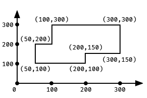
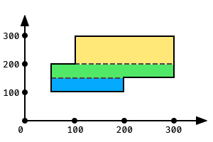
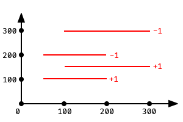
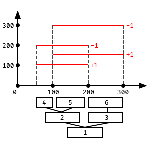
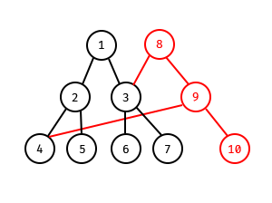

# 浅谈线段树
最近在复习线段树的模板题，于是写一写自己的积累。
## 何为线段树
简单来说，线段树是一种数据结构，它比树状数组更灵活，支持但不仅仅限于：

- 区间修改
- 区间查询
- 单点修改
- ...

由于其强大的灵活性因此在许多 OI 题中以及实际工程中得到了广泛的应用。一般的，对于一个长度为 $n$ 的数列所建的线段树最少需要 $4n$ 的空间。其单次操作时间复杂度 $\Theta=\log n$ .

__对于一般的线段树，在此不多赘述__，建议移步 OI-wiki : 🔗 https://oi-wiki.org/ds/seg/
## 区间乘法
很多时候我们不仅仅进行区间加法，也需要进行区间惩罚。这时候我们就需要对延迟标记进行更改。

延迟标记的定义：表示 __该区间的答案已被修改但尚未更改其子区间的答案__ 。也就是说如果 $\texttt{tree[i].tag} \neq 0$ 则 $\texttt{tree[i].value}$ 已经被更改，但是 $\texttt{tree[2i].value}$ 以及 $\texttt{tree[2i+1].value}$还没有更改。

当我们需要传递两种不同的运算时，就需要两个延迟标记，一个代表加法 $\texttt{add}$ ，一个代表乘法 $\texttt{mtp}$ 。接下来就是确定先传递哪一个。

看一个简单的例子： $(t\times a)+b$ 怎么改写成先加后乘的形式？很明显是 $(t+c)\times d$ , 其中 $d=a,c=\dfrac{b}{d}$ .很明显，$d$ 出现除法有可能损失精度，这并不是我们想要的。

那反过来： $(t+a)\times b$ 怎么改写成先乘后加的形式？答案是 $t\times c+d$ ,其中 $c=b,d=ab$. 很明显，乘法不会丢失精度，因此相较而来，我们偏向于选择乘法优先。

下面放个伪代码：

$\textbf{SPREAD(x)}:\\
value(2x) \leftarrow (r(2x)-l(2x)) \times add(x)+mtp(x) \times value(2x)\\
value(2x+1) \leftarrow (r(2x+1)-l(2x)) \times add(x)+mtp(x) \times value(2x+1)\\
\ \\
add(2x) \leftarrow add(2x)+add(2x) \times mtp(x)\\
add(2x+1) \leftarrow add(2x+1)+add(2x+1) \times mtp(x)\\ \ \\
mtp(2x) \leftarrow mtp(2x) \times mtp(x)\\
mtp(2x+1) \leftarrow mtp(2x+1) \times mtp(x)\\
\ \\
add(x) \leftarrow 0\\mtp(x) \leftarrow 1
$

## 扫描线
作为线段树的一个典型应用，扫描线在几何问题中的应用相当广泛。
### 面积并
```
给定平面直角坐标系中的 N 个矩形，求它们的面积并，即这些矩形的并集在坐标系中覆盖的总面积。( Luogu P5490 / POJ 1151 )
```
一般的暴力显然不可取，容斥也显然不可解。于是扫描线横空出世。我们以下面的这张图为例：



扫描线，顾名思义，就是有一根线扫来扫去，图形的面积就是其被截长度 × 扫过距离。如图所示：



在这里，我们将矩形的底边跟定边取出来构建四元组 $(y,x_1,x_2,opt)$ .
$y$ 表示其所在的纵坐标，$x_1$ 表示其被截的左端点，$x_2$ 表示被截的右端点，$opt$ 表示在这里应该加还是减一条边。一般的，我们将矩形的底边的 $opt$ 设为 $+1$ ，而顶边设为 $-1$，从而保证不会出现截取的线段长度为负值。下图为其四个四元组的位置以及其 $opt$ 的值。



同时，我们还要存储底边跟顶边的端点信息。在这个例子中，四个横边的端点将整个 $x$ 轴分为了 $3$ 段。而我们就建立一颗线段树来维护这三段的信息。如下图：



那么这颗线段树存什么呢？存储两个值： $\texttt{cover}$ 与 $\texttt{len}$ . 其中 $\texttt{cover}$ 代表这个区间目前被几个矩形所覆盖，而 $\texttt{len}$ 代表这个区间被覆盖的长度。__显然的，如果 $\texttt{cover} \neq 0$ 那么 $\texttt{len}=$ 这个区间的长度。我们通过不断扫描更新 $\texttt{cover}$ 的值，从而更新 $\texttt{len}$ 的值，不断从叶子节点上传修改根节点，最终根节点的 $\texttt{len}$ 就是我们所求的扫描线被截长度。__

但目前我们又遇到了一个问题：__这个线段树节点的 $l$ 与 $r$ 该怎样存储？__ 数据范围是 $10^9$，如果我们仍然按传统的存法必然爆炸，因此进行 __离散化__ 。

原来的，我们有 $[50,100],[100,200],[200,300]$ 三个区间。离散化后，我们将 $50 \rightarrow 1,100 \rightarrow 2,200 \rightarrow 3,300 \rightarrow 4.$ 那么就变为了 $[1,2],[2,3],[3,4]$ 三个区间。

__线段树节点的 $l$ 与 $r$ 存储离散化后的数据__。那么怎么获取原始数据呢？我们定义一个数组 $X[\ \ ]$ 使得 $X[i]$ 代表离散化后 $i$ 所代表的原始数据。下面是这个例子中 $X[\ \ ]$ 数组：

|$i$|1|2|3|4|
|-|-|-|-|-|
|$X[i]$|50|100|200|300|

$X$ 数组很好得到，把原始数据去重排序就可以得到。下面是线段树节点的数据：（刚建完树时）

| $i$ | 1 | 2 | 3 | 4 | 5 | 6 |
|---|---|---|---|---|---|---|
| $\texttt{tree[i].}l$ | 1 | 1 | 2 | 1 | 2 | 3 |
| $\texttt{tree[i].}r$ | 3 | 2 | 3 | 1 | 2 | 3 |

看到这里你可能会疑问：为什么 $\texttt{tree[1]}.r=3$ 而不是 $4$，__这里我们为了方便统一，定义 $\texttt{tree[i]}$ 所代表的实际长度是 $X[\texttt{tree[i]}.l] \sim X[\texttt{tree[i]}.r+1]$__. 

最后便是标识的上传。__这里线段树更新数据不再是从根节点向下传，而是由叶子节点向根节点传，因此也不需要延迟标记。__ 放个伪代码：

$\textbf{PUSHUP(x):}\\
\textbf{if} \ \ tree[x].cov \neq 0\\
\ \ \ \ \ \ tree[x].len \leftarrow X[tree[x].r+1]-X[tree[x].l]\\
\textbf{else}\\
\ \ \ \ \ \ tree[x].len \leftarrow tree[2x].len+tree[2x+1].len\\$

__如果一个节点的 $\texttt{cov}$ 或 $\texttt{len}$ 被更改了，就应该立刻进行上传。__

最后明晰了这些概念以后，我们模拟一下整个代码的运行过程：

- 读入，进行离散化，构建 $X[\ \ ]$ 数组。
- 对于每个底边或顶边，建立四元组 $(y,x1,x2,opt)$
- 对四元组排序，确保不会出现负数
- __建立线段树，按顺序读入四元组修改线段树，每处理一个四元组答案就增加（现在的 $y-$ 刚才的 $y$) $\times \texttt{tree[1].len}$__

### 周长并
```
给定平面直角坐标系中的 N 个矩形，求它们的周长并，即这些矩形的并集在坐标系中覆盖的总周长。( POJ 1177 )
```

周长并与面积并实际上差不多，只不过统计的对象从面积变为了边长。我们在扫描时不再进行面积的计算，而是将边长直接加进 $ans$ 中，对于横边与纵边分别进行扫描，所得即为周长并。

## 线段树的可持久化改造
```
可持久数据结构主要指的是我们可以查询历史版本的情况并支持插入，利用使用之前历史版本的数据结构来减少对空间的消耗
```
```
给定 n 个整数构成的序列 a，将对于指定的闭区间 [l,r] 查询其区间内的第 k 小值。( Luogu P3834 / POJ 2104 )
```
虽然上面是洛谷的模板题，但这个题面很容易让初学者一头雾水：哪里询问历史版本了？因此，我们不妨先看另外一个题目：
```
给定 n 个整数构成的序列 a,有如下命令：
- 1 l r i 查询其闭区间 [l,r] 第 i 次修改前的总和
- 2 l r v 对于其闭区间 [l,r] 内的每个元素都增加 v
```
这个题面可能更好理解些。

首先，我们想到暴力解决，对于每次修改都新建一颗线段树。不用想都会爆炸。此时我们想到，每次修改时，我们都只是改变了线段树的一个节点以及其所有父节点。那我们就没必要每次都新建一颗线段树，而是只新建修改的部分即可。



__注意，这棵线段树是动态开点，即 $i$ 节点的左右子节点不一定是 $2i$ 与 $2i+1$ .__
如图，如果我们想要修改节点 $5$ 的数据并保留之前的数据，我们完全可以新建如图红色的部分，使他们没有被修改的部分如图指向原来的节点，从而节约空间。

如果我们想要访问历史版本，我们就直接进入对应的根节点向下找即可，比如图中我们想要访问第一次的记录，我们就从 $1$ 号节点出发。如果我们想要访问第二次的记录，我们就从 $8$ 号节点出发。

__新建一个 $root$ 数组，其中 $root[i]$ 代表第 $i$ 次记录对应的根节点编号。这样，我们就实现了线段树的可持久化。__ 

贴个单点修改并保存历史版本的伪代码：
( 基于以 $last$ 为根节点的线段树修改存有 $val$ 区间的值，并且该节点的范围为 $l \sim r$ ，修改完后返回创建的节点的编号 $p$ )

$\textbf{UPDATE(last,val,l,r)}\\
tot \leftarrow tot+1\\
p \leftarrow tot\\
lson(p) \leftarrow lson(las)\\
rson(p) \leftarrow rson(las)\\
\textbf{if }l \neq r\\
\ \ \ \ mid \leftarrow \dfrac{l+r}{2}\\
\ \ \ \ \textbf{if } val \leq mid\\
\ \ \ \ \ \ \ \ lson(p) \leftarrow \textbf{UPDATE(lson(las),val,l,mid)} \\
\ \ \ \ \textbf{else}\\
\ \ \ \ \ \ \ \ rson(p) \leftarrow \textbf{UPDATE(rson(las),val,mid+1,r)}\\
\textbf{return } p
$

比如我们想要在以 $1$ 为根节点的线段树上按例图增加红色部分，__假设叶子节点分别存 $[1,1],[2,2],[3,3],[4,4]$__，只需要令 $root[2]= \text{UPDATE(1,1,1,4)}$ 即可。最终得到 $root[2]=8$.

那回到之前的问题，查询第 $k$ 小跟可持久化是怎么扯上的关系呢？这里，我们建立的不再是一般意义上的线段树，而是 __权值线段树__。

有关权值线段树的内容建议移步 @Seaway Fu 的博客🔗 https://www.cnblogs.com/fusiwei/p/12234435.html

有了权值线段树，就可以进行第 $k$ 小问题的求解。

鉴于博主比较懒，第 $k$ 小问题的求解建议移步 @Euler_Pursuer
的博客 🔗 https://www.luogu.com.cn/blog/LonecharmRiver/zhu-xi-shu

（完）